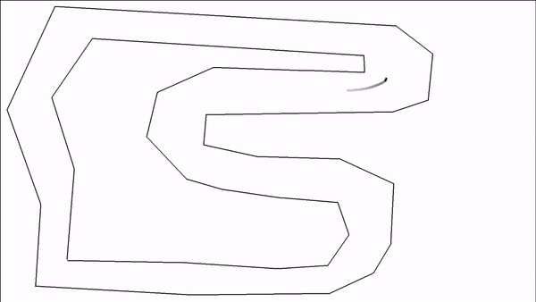

mlCar 
=================================================================================================================================================================================
**mlCar** – программа, обучающая машину ездить по треку.

Так выглядит трек при обучении:

Для обучение используется принцип эволюции: машины получают очки за преодолевание зелёных линий, 
те, у кого больше всего очков, выживают и копируют себя с небольшими изменениями в своём интеллекта (из-за этого чуть меняется их поведение). 
Выживает сильнейший, происходит естественный отбор, с каждым поколением скорость и точность прохождения увеличивается.

В основе интеллекта лежит нейронная сеть, которая принимает на вход расстояния до границ, если смотреть в 15 различных направлениях

Пример работы
------------

Запуск
------------
    $ python3 mlCar.py

Для запуска в режиме обучения нужно изменить режим в коде. По умолчанию коэффициенты нейронной сети хранятся в `data/data.txt`